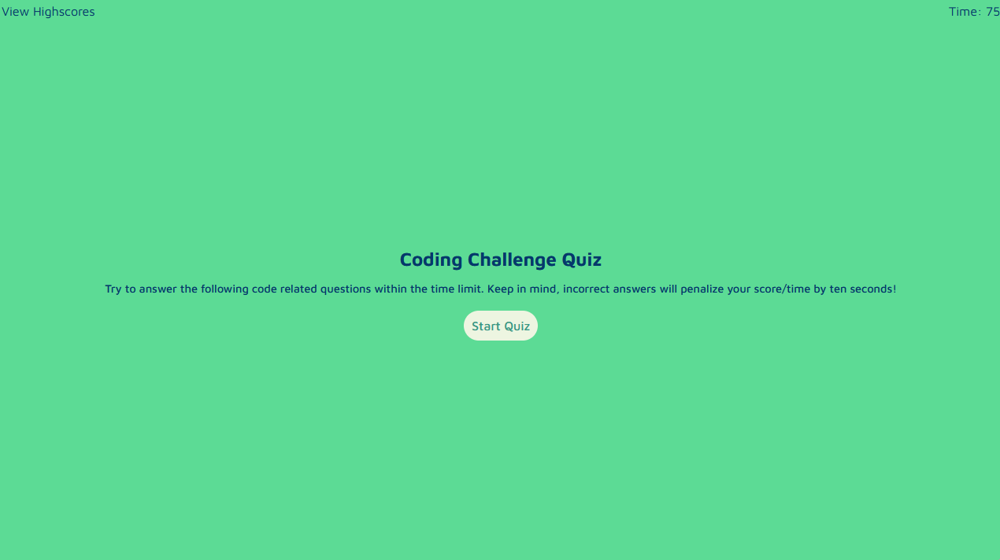
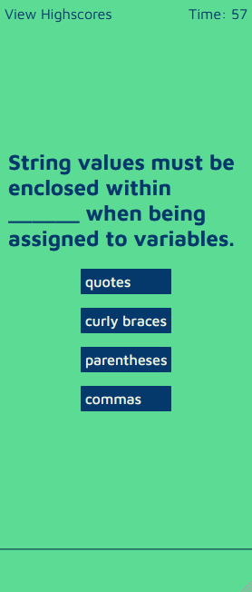

# JavaScript Quiz

A timed, browser based JavaScript quiz. Built using vanilla JavaScript.

Visit here: https://theodoremoreland.github.io/JavaScriptQuiz/

### How to play

Once you press the "Start Quiz" button, the timer will count down by one point per second. If you get an answer wrong, 15 points / seconds will be subtracted from the timer. If your score / time goes to 0 or less, the game will immediately end. By the end of the game, whatever time is left on the timer is your final score.

### Features

- Responsive w / mobile first design
- Persistent storage via localStorage API
- Sound effects

### Technologies used

- HTML5
- CSS3
- JavaScript (ES6)
- GitHub Pages

## Screenshot (Mobile)

### Home screen

### Question

### Another question

### End game screen upon time expiring

### Highscores list

## Screenshots (Desktop)

### Home screen

### Question after correctly answering previous question

### Question after incorrectly answering previous question

### End game screen with a score of 60

### Highscores list

