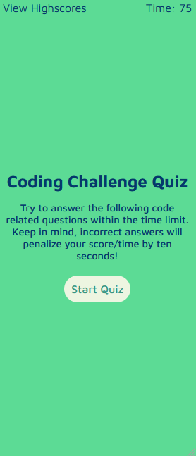
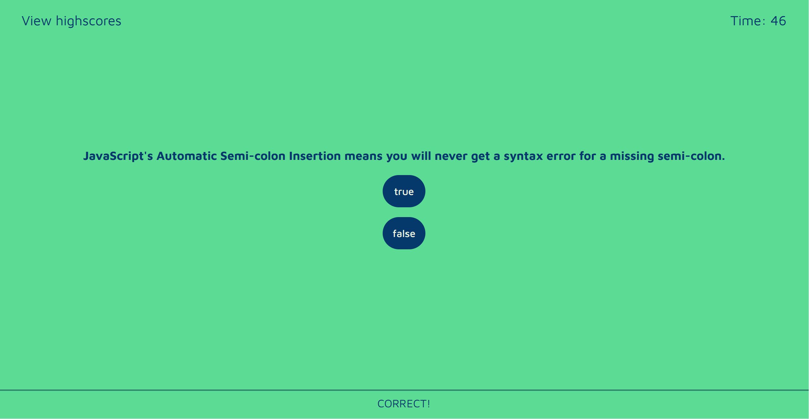
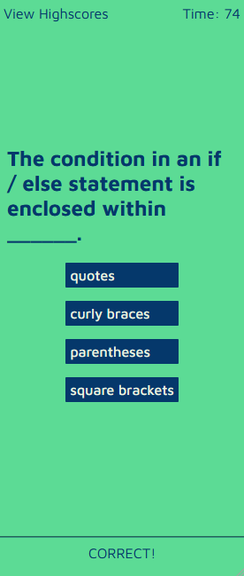
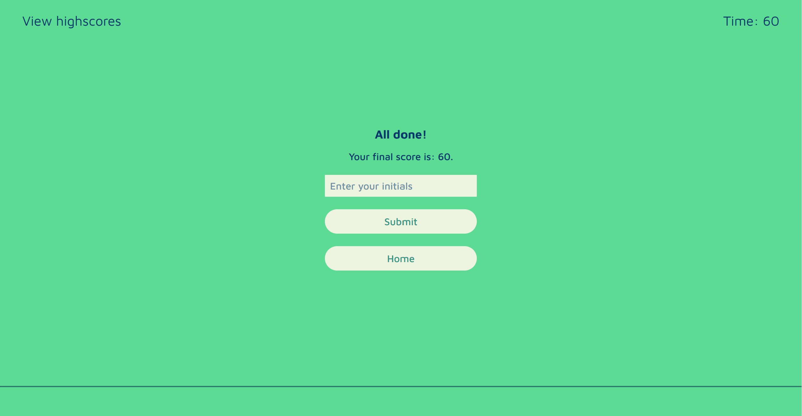
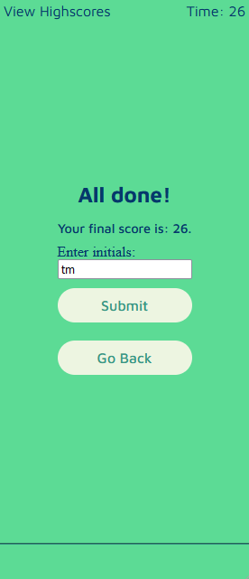
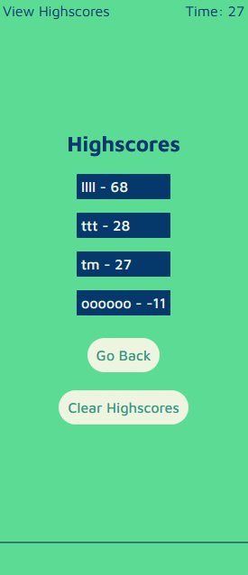

# CodeQuiz
A timed, browser based coding quiz. Built using vanilla JavaScript. Automated testing with Jest.

### How to play
Once you press the "Start Quiz" button, the timer will count down by one point per second. If you get an answer wrong, 15 points / seconds will be subtracted from the timer. If your score / time goes to 0 or less, the game will immediately end. By the end of the game, whatever time is left on the timer is your final score.

### Features
* Responsive w / mobile first design
* Persistent storage via localStorage API
* Sound effects

### Technologies used
* HTML5
* CSS3
* JavaScript (ES6)
* Jest
* GitHub Pages

### Future improvements
* Flesh out testing suite(s)
* Replace questions (make them more obscure and original)

# Screenshots

## Default view (Galaxy Fold emulation)

## After starting quiz (Galaxy Fold emulation)

## Second question (Galaxy Fold emulation)

## Third question etc... (Galaxy Fold emulation)

## After quiz is completed (Galaxy Fold emulation)

## High scores screen (Galaxy Fold emulation)
*Screenshots were not taken as a part of the same playthrough, hence scores / times not being reflective of previous screenshots*

